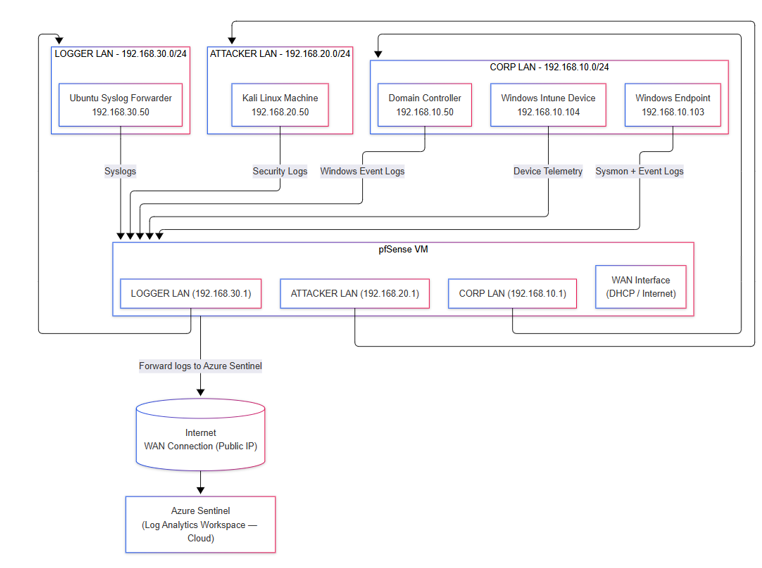
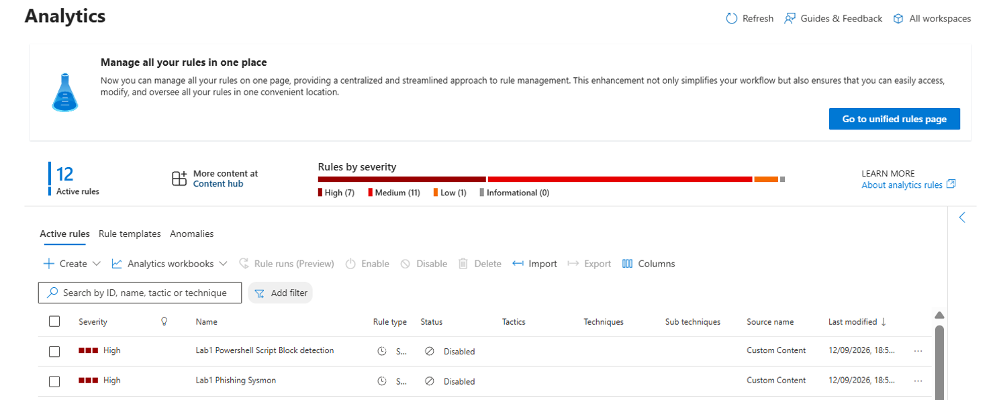
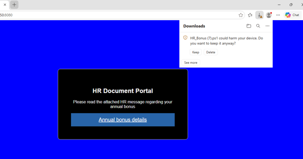

# Zero Trust Attack-Chain Lab

**Evaluating how Zero Trust controls change the progression and detectability of a multi-stage, human-driven cyberattack in a simulated hybrid enterprise environment.**

This is a condensed, portfolio version of my university project which summarises the build, the attack chain, and the results — the full academic report (literature review, risk register, appendices) isn't reproduced here.

## Research Question

> When an attack against a hybrid environment involves human-related security weaknesses, how do Zero Trust controls alter attack progress and improve its detectability?

Traditional security models trust based on network location — being "inside" the perimeter is treated as safe. Zero Trust (NIST SP 800-207) replaces that with continuous verification, least privilege, and assumed breach. This project tested that shift directly: the **same attack chain, run twice** — once against a weak, location-trust baseline, once after Zero Trust controls were applied — comparing what got through, and what got detected, at each stage.

## Environment

A hybrid lab built in VirtualBox, segmented with pfSense:

**Network segments**

| Segment | Range | Purpose |
|---|---|---|
| Corporate LAN | 192.168.10.0/24 | Windows Server (AD Domain Controller), Windows endpoints, one Intune-managed device |
| Attacker LAN (untrusted) | 192.168.20.0/24 | Kali Linux |
| Logger LAN | 192.168.30.0/24 | Syslog forwarder

**Tooling**

- **Identity & endpoint:** Microsoft Entra ID, Conditional Access, Intune, Defender
- **Detection:** Microsoft Sentinel, Log Analytics Workspace, Data Collection Rules, Azure Monitor Agent, Azure Arc, KQL
- **Offensive tooling:** Kali Linux, Nmap, NetExec, Wireshark



## Method

Built iteratively: plan a control objective → implement it → run the attack step → evaluate the telemetry → refine. Three lab scenarios (phishing, credential compromise, SMB/honeytoken) were ultimately combined into a single **10-stage attack chain**, tracing one compromised identity (`jgreen`) from initial phishing click through to automated incident response — a more realistic test of how Zero Trust controls perform cumulatively rather than as isolated checks.

---

## Lab 1 — Phishing → PowerShell Payload

**Tested:** does enabling Sentinel detection logic actually catch a phishing-delivered payload execution?

A phishing page (hosted on Kali) delivered a PowerShell payload to a Windows endpoint. Execution generates Sysmon Event ID 1 and PowerShell Script Block Logging (Event 4104) — but only if the relevant analytics rules are switched on.

Detection rate went from **0% to 100%** once the relevant rules were live. Mean time to detect (MTTD) across the post-ZT runs was **~11m 16s**, increasing slightly run to run — a reminder that "detected" and "detected fast" aren't the same thing.

<details>
<summary>📷 Evidence — Lab 1</summary>


*Sentinel analytics rules disabled pre-ZT*


*Phishing page and Windows Mark of the Web warning*


*PowerShell execution on the Windows endpoint*


*Sentinel alerts generated post-ZT*

</details>

## Lab 2 — Password Spray & Credential Compromise

**Part A — reaching the Domain Controller.** Pre-ZT, pfSense allowed Kali to reach the DC directly. An Nmap scan enumerated LDAP and SMB as open; a NetExec password spray against LDAP (decoy accounts + one seeded weak-but-compliant password) produced a successful authentication after multiple failures. Post-ZT, a pfSense rule denied all Kali→DC traffic — the same Nmap scan reported the ports as *filtered*, the password spray couldn't establish a connection at all (confirmed via a Wireshark capture showing dropped SYNs, no SYN-ACK/RST), and no new authentication events reached Sentinel.

<details>
<summary>📷 Evidence — Lab 2, Part A (network)</summary>


*Nmap scan pre-ZT showing open ports on the DC*


*Successful password spray result*


*Nmap scan post-ZT showing ports filtered*


*NetExec unable to connect after pfSense rule change*


*Wireshark capture showing dropped SYN packets*


*Sentinel showing no new authentication events from Kali*

</details>

**Part B — reusing the compromised credential against the cloud.** Network segmentation alone didn't help here: Entra ID authentication happens independently of the on-prem network, so the compromised `jgreen` credentials signed in to Microsoft 365 from Kali regardless of the pfSense rule. Only after Conditional Access policies were applied (MFA + device compliance required) was that sign-in blocked — confirmed in the Entra sign-in logs. The same identity, from the Intune-managed compliant device, was allowed straight through. **Same credentials, different outcome — the control was evaluating context, not just the account.**

<details>
<summary>📷 Evidence — Lab 2, Part B (identity)</summary>


*Sign-in to Microsoft 365 from Kali using compromised credentials*


*MFA prompt following Conditional Access policy*


*Entra sign-in logs showing Conditional Access blocking the sign-in*


*Successful sign-in from the Intune-managed compliant device*

</details>

## Lab 3 — SMB Misconfiguration & Honeytoken Detection

**Part A — least privilege.** `jgreen` was (mis)configured with access to a Corporate share as well as the intended Employee share — a realistic over-permissioning error. Pre-fix, files were accessed and copied from the Corporate share (simulated exfiltration). Removing the unnecessary group membership restricted the account to the Employee share only, on the same identity, same credentials.

<details>
<summary>📷 Evidence — Lab 3, Part A (least privilege)</summary>


*Corporate SMB share accessed and files copied pre-ZT*


*Event ID 5145 in Windows Event Viewer*


*Event ID 5145 visible in Sentinel*


*SMB access restricted to Employee share post-ZT*

</details>

**Part B — honeytoken detection.** An "Executive Salaries" folder was planted as a monitored decoy with object-access auditing enabled (Event ID 4663), feeding a Sentinel analytics rule.

| Run | Time to incident (MTTD) | Alerts generated |
|---|---|---|
| 1 | 8m 42s | 10 |
| 2 | 18m 19s | 5 |
| 3 | 8m 25s | 6 |

Detection time varied noticeably between otherwise-identical runs — a useful, honest finding about SIEM pipeline variability rather than instant detection. An automation rule auto-triaged each incident to "In Progress."

<details>
<summary>📷 Evidence — Lab 3, Part B (honeytoken)</summary>


*Honeytoken folder accessed*


*Honeytoken incidents raised in Sentinel*


*Sentinel analytics rule configuration for the honeytoken*

</details>

---

## Full Attack Chain — Mapped to MITRE ATT&CK

| # | Stage | MITRE ATT&CK | Zero Trust pillar | Lab |
|---|---|---|---|---|
| 1 | Phishing email → PowerShell payload | T1566 Phishing; T1059.001 Command & Scripting Interpreter | Endpoint / Visibility | 1 |
| 2 | Nmap service discovery | T1595 Active Scanning | Network (none, pre-ZT) | 2 |
| 3 | NetExec password spray vs LDAP | T1110.003 Password Spraying | Identity (none, pre-ZT) | 2 |
| 4 | pfSense segmentation applied | *(defensive control)* | Network | 2 |
| 5 | Compromised creds → M365 sign-in | T1078.004 Valid Accounts: Cloud Accounts | Identity (none, pre-ZT) | 2 |
| 6 | Conditional Access blocks sign-in | *(defensive control)* | Identity (MFA, device compliance) | 2 |
| 7 | SMB share accessed with excess permissions | T1135 Network Share Discovery | Data (least privilege) | 3 |
| 8 | File exfiltration via SMB | T1039 / T1048 | Data (least privilege) | 3 |
| 9 | Honeytoken file accessed | T1005 Data from Local System | Visibility (deception) | 3 |
| 10 | Sentinel automated response | *(defensive action)* | Visibility, Automation & Orchestration | 3 |

---

## Key Findings

No single control stopped the attack chain. Network segmentation stopped on-prem lateral movement but did nothing against cloud sign-in with a stolen credential; identity controls (Conditional Access) stopped that, but only once applied; least-privilege enforcement reduced what a compromised identity could reach; and honeytokens/monitoring caught the parts that got through preventative controls entirely. Zero Trust's value here came from **layering** these across pillars, not from any single pillar in isolation — consistent with NIST SP 800-207's framing of ZT as cumulative rather than a single product or setting.

## Recommendations

- Enforce continuous identity verification (Conditional Access: MFA + device compliance) so a stolen credential alone isn't enough for cloud access.
- Apply least privilege to SMB shares, AD groups and cloud roles, with regular access audits.
- Segment/restrict network reachability to critical assets like domain controllers to limit reconnaissance and lateral movement.
- Use honeytokens and file-access auditing as a detection layer for when preventative controls fail.
- Pair technical controls with phishing-awareness training, since the initial vector here was human.
- Feed detections into automated SOAR-style response (isolate device, disable account, block IP) to cut response time once an incident fires.

## Tech Stack

`VirtualBox` · `pfSense` · `Windows Server / Active Directory` · `Kali Linux` · `Nmap` · `NetExec` · `Wireshark` · `Microsoft Entra ID` · `Conditional Access` · `Intune` · `Defender` · `Microsoft Sentinel` · `Log Analytics Workspace` · `KQL` · `Azure Monitor Agent` · `Azure Arc`

## Scope & Limitations

Lab-based and simulated — this doesn't measure real-world human error rates, only tests controls against realistic, research-informed attack behaviour. pfSense here demonstrates network segmentation, not full Zero Trust micro-segmentation (out of scope). Detection timing (MTTD) was measured; analyst response time (MTTR) wasn't, since no live SOC analyst was simulated. All data is synthetic, built with GDPR/UK DPA principles in mind from the start.

## Repo Structure

```
.
├── README.md
└── evidence/
    ├── architecture-diagram.png
    ├── lab1-detection-rules-disabled.png
    ├── lab1-phishing-page-motw.png
    ├── lab1-powershell-execution.png
    ├── lab1-sentinel-alerts.png
    ├── lab2-nmap-prezt.png
    ├── lab2-password-spray-success.png
    ├── lab2-nmap-postzt-filtered.png
    ├── lab2-netexec-blocked.png
    ├── lab2-wireshark-dropped-syn.png
    ├── lab2-sentinel-no-new-events.png
    ├── lab2-m365-signin-kali.png
    ├── lab2-mfa-prompt.png
    ├── lab2-entra-ca-block.png
    ├── lab2-entra-signin-compliant-device.png
    ├── lab3-smb-access-corporate.png
    ├── lab3-event5145-eventviewer.png
    ├── lab3-event5145-sentinel.png
    ├── lab3-smb-access-restricted.png
    ├── lab3-honeytoken-access.png
    ├── lab3-honeytoken-incidents.png
    └── lab3-honeytoken-rule-setup.png
